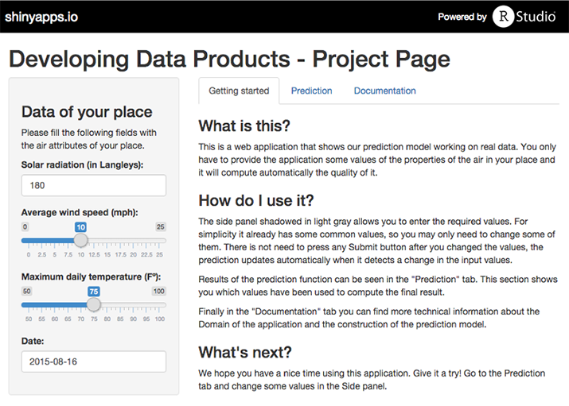

---
title       : Predicting airquality
subtitle    : Developing Data Products - Coursera Data Science Specialization
author      : David Álvarez
job         : 
framework   : impressjs        # {io2012, html5slides, shower, dzslides, ...}
highlighter : highlight.js  # {highlight.js, prettify, highlight}
hitheme     : tomorrow      # 
widgets     : [mathjax, bootstrap]            # {mathjax, quiz, bootstrap}
mode        : selfcontained # {standalone, draft}
knit        : slidify::knit2slides
--- 
# Predicting Airquality
### Developing Data Products - Coursera

Author: *David Álvarez*


--- .slide x:1000 y:0 scale: 1

# Airquality Dataset

Airquality data set is available in R using the following command:

```{r load_airquality}
data(airquality)
```

Resulting in a dataset with the same name: 

```{r head_airquality}
head(airquality, 4)
```


--- .slide x:1000 y:2000 scale:2
# Dataset description

The air quality data contains the following columns: 
```
- Ozone: Mean ozone in parts per billion.  
- Solar.R: Solar radiation in Langleys.  
- Wind: Average wind speed in mph.  
- Temp: Maximum daily temperature in Fº.  
- Month: Month of sample.
- Day: Day of sample.
```
We want to **predict Ozone levels** in terms of other columns, that is: 

$$Ozone \sim Solar.R + Wind + Temp + Month + Day$$

--- .slide x:6000 y:6000 scale:5 rot:45
# Prediction model

We have used the `caret` package to train the prediction model: 

```{r cleanning_up, echo=FALSE}
airquality <- airquality[!is.na(airquality$Ozone),];
airquality <- airquality[!is.na(airquality$Solar.R),];
```

```{r training, warning=FALSE, message=FALSE}
library(caret)
model <- train(Ozone ~ ., 
               data = airquality, 
               method="lm");
```

But using R is too complicated for some users.

We have created a Shiny Application to interact with the prediction model easily through a friendly user interface.


--- .slide x:4000 y:1500 scale:1 rot:200
# Shiny Application

Visit: https://davizuku.shinyapps.io/project


